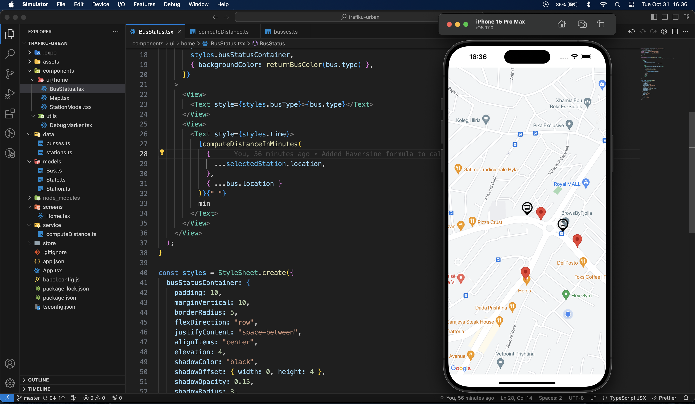
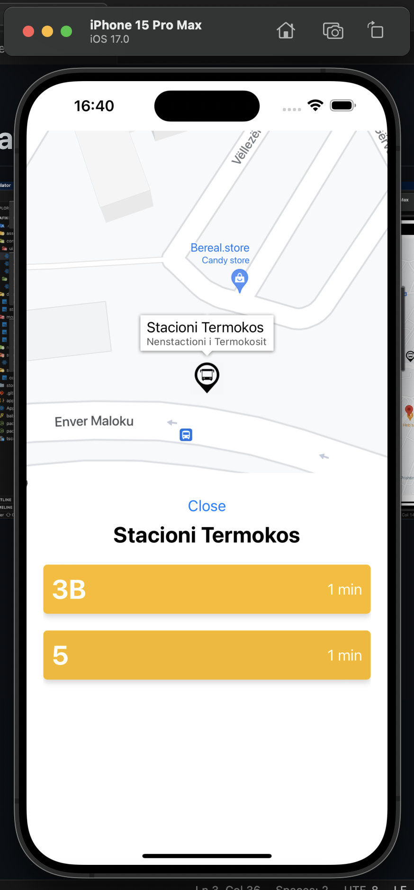

# Trafiku Urban - Bus Tracker

## Information about this app

This application was made using _React Native_.
It's supposed to track buses and bus stations around Prishtina and give the user a approximate time of the bus arrival.

## Running App
Run these commands in order:
`git clone https://github.com/alitinart/trafiku-urban`
`npm i`
`npx expo start`

Either run the app through a simulator or run it on your phone via the Expo App

## App Previews:

  

